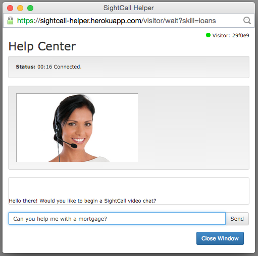
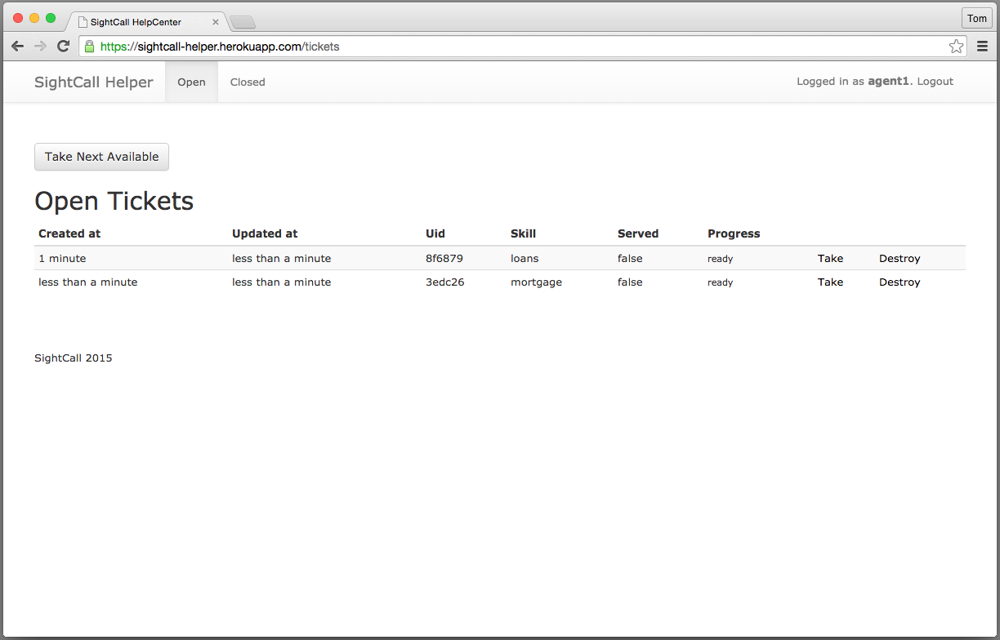
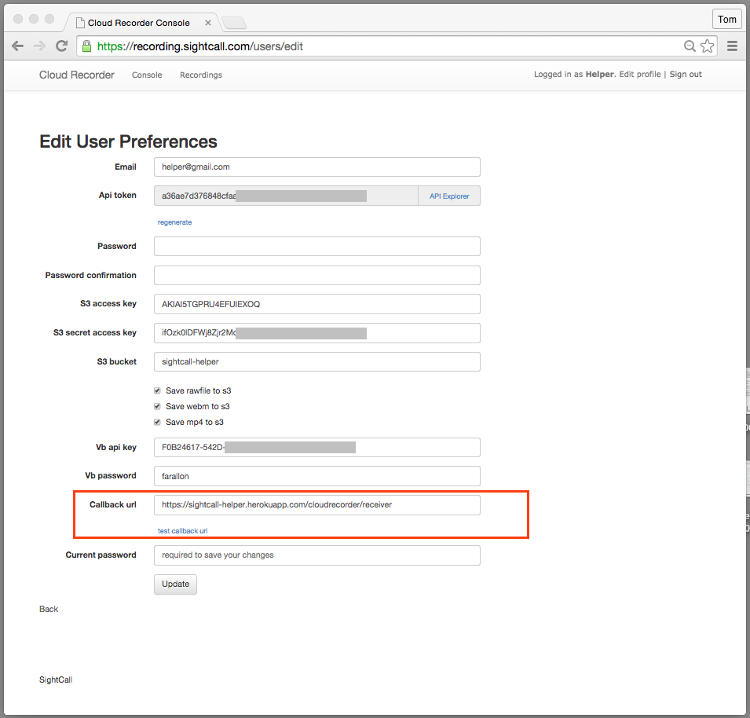
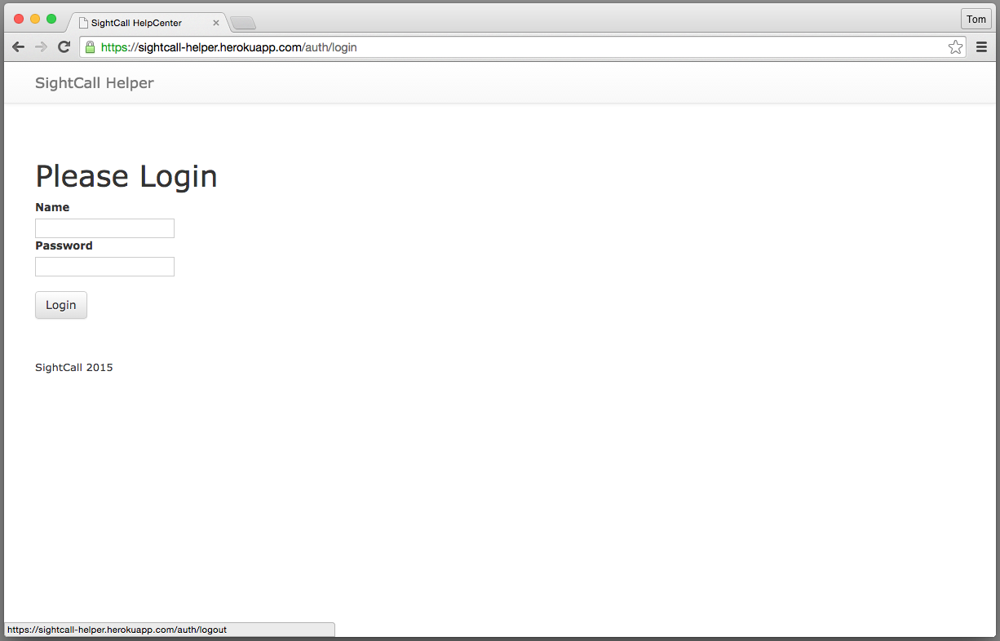
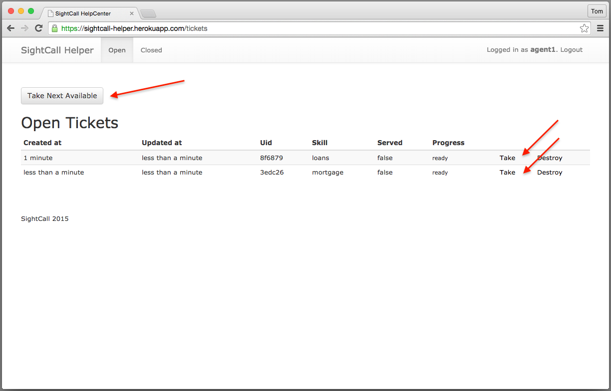
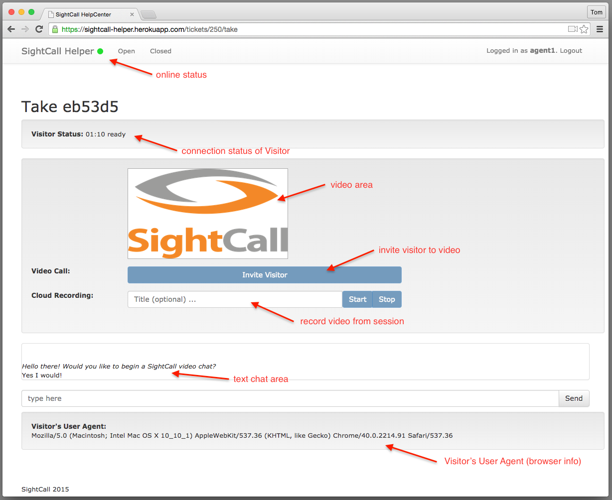
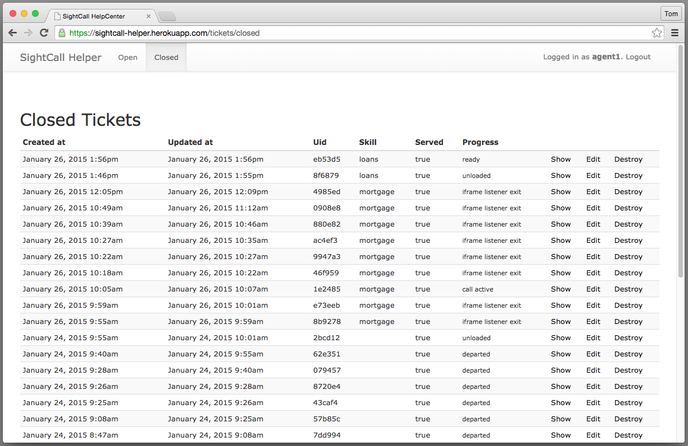
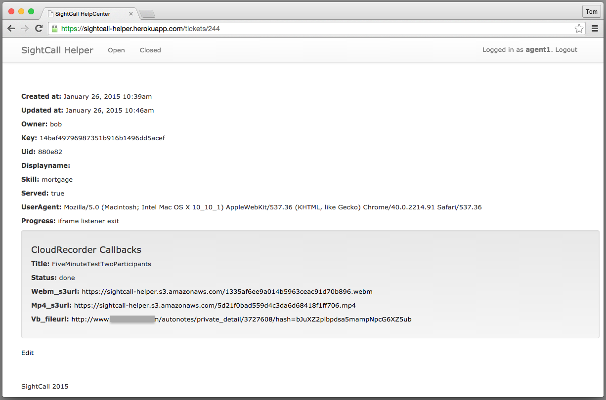
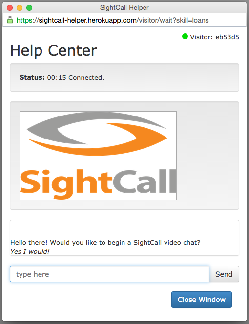
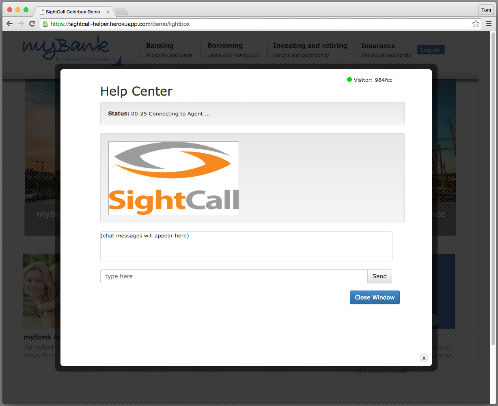

SightCall Helper
================================================================

<p><a href="https://heroku.com/deploy?template=https://github.com/sightcall/Helper"></a></p>


SightCall **Helper** is a demonstration web application showcasing
Real-Time Communication for a small online Customer Service center.  It
showcases "Live Text Chat" with an invitation to "Video Chat."
Helper showcases the following features of the SightCall platform.

- Text Chat
- Video Teleconference
- Recording (optional)
- Multi-browser support Chrome (webrtc), Safari, Internet Explorer, Firefox (plugin)


## Overview

A Visitor enters the help queue by clicking on a "Video Assistance"
button in a web site.  The Visitor's help window has a text-chat area 
and a video window that can show the video feed of the Agent.



The Agent console displays a list of tickets waiting to be
serviced.  An Agent may select a specific visitor to help, or may
select the next ticket in queue order.




SightCall Helper has been created using common web technologies
([Rails](http://rubyonrails.org/),
[Bootstrap](http://getbootstrap.com), [jQuery](http://jquery.com/)),
and is purposely kept small so that it can serve as a starting point
for a complete project.  It is not only a showcase of SightCall
technologies, it is also a tutorial of best-practices and idioms to
use for embedding SightCall features into your own site.

Helper is easy to clone and run on your own servers, or you can try
it out by deploying on Heroku. (Even a free/hobby account will
suffice.) Read on.

## Run It On Heroku

You can run your own instance of SightCall Helper on Heroku in
just a few minutes.

- If you have not already, you should request an API KEY and credentials from SightCall.
  Get it here: [http://www.sightcall.com/developers/](http://www.sightcall.com/developers/).

Once you have registered, you will need these four pieces of information.

- your RTCC_APP_ID
- your RTCC_CLIENT_ID  (this identifies your API KEY)
- your RTCC_CLIENT_SECRET (this is the secret part)
- your RTCC_DOMAIN_IDENTIFIER (example: "acme.com")


#### Use the Heroku Button

The easiest way to try out Helper is to press the purple "Heroku
Button" above.  This will clone this repository into your Heroku
account and launch an instance.  Put the RTCC credentials you gathered
above into the Environment Variable slots, and you are off and
running!

#### Or clone this repository and then push to Heroku

- Clone this repository so you can customize it.
- Create a new Heroku project for this demo.

```sh
    % heroku create
```

Note the URL of the project you just created.  (E.g. https://adjective-noun-1234.herokuapp.com)

- Push the code to Heroku

```sh
    % git push heroku master
```

- Run the `bootstrap` task (in file lib/rake/bootstrap.rb).  This
  creates the database and the default users.  If you would like to
  customize the default users, you can edit the task before you invoke
  it.

```sh
    % heroku run bundle exec rake bootstrap
```

- Set the following Heroku environment variables as appropriate for your SightCall account.

```sh
    % heroku config:set RTCC_APP_ID=ab01cd34ef56
    % heroku config:set RTCC_CLIENT_ID=7a7a7a7a7a8b8b8b8b8b9c9c9c9c9c
    % heroku config:set RTCC_CLIENT_SECRET=19ab19ab19ab19ab28cd28cd28cd28
    % heroku config:set RTCC_DOMAIN_IDENTIFIER=acme_video.com
```

Visit the application at your Heroku URL and log-in as one of the
pre-defined Agents.

- agent1 / a1password
- agent2 / a2password
- agent3 / a3password
- agent4 / a4password

On a different computer, have someone else visit the demo page at
https://your-app-1234.herokuapp.com/demo/plain and ask for **Video
Assistance** by clicking the picture of the Video Agent.


#### Or, Run the Rails project locally

Of course, you can run this Rails project on your local machine.  Edit
the file `config/environment.rb` to set the RTCC environment variables
directly.  The general procedure would be this.

```sh
    % git clone git@github.com:sightcall/Helper.git
    % cd Helper
    % bundle install       (install the gems)
    % bin/rake bootstrap   (migrate the DB and make default users)
    % bin/rails s          (run the server)
```

Then visit it at [http://localhost:3000](http://localhost.3000).

And if you want to develop locally, but debug on the public internet,
I can recommend [ngrok](http://ngrok.com).

```sh
    % ngrok http 3000
```

This will expose your local webserver to an HTTPS port on the public internet.


## Add the Recording Feature

Contact SightCall if you are interested in Recording video calls.  We
can provide you with a CloudRecorder token.  Once you receive it, add
it to your Helper project this way.

```sh
    % heroku config:set CLOUDRECORDER_TOKEN=xxyyxxyy27331b82ef0e8fa9bfe37fcb
```

And in the cloud-recorder console, set the Callback URL to the your
instance of Helper.  This is how the Cloud-Recorder notifies your
instance of Helper of its progress converting the movies.




## Feature Overview

### Login Page

Agents log in with a username and password.




### Select a Ticket

Agents can select a 'ticket' to work on in one of two ways.  They can
select the next available ticket ("Take Next Ticket") or they can
select a particular ticket (by clicking the individual "Take" button).




### Interact with a Visitor

An Agent interacts with a Visitor in the "Take" window.  Some items to note.

- the green dot next to "SightCall Helper" means the Agent is connected to the Realtime cloud
- the title "Take eb53d5" identifies the ticket number of the anonymous Visitor
- the "Invite Visitor" button invites the Visitor to Video only after Text Chat has begun
- the Video from the session may be recorded by the CloudRecorder with an optional Title
- the Text Chat area is active as soon as possible
- the Visitor's browser information is available at the bottom of the screen



### List Open Tickets

Agents can list the Open Tickets and see how long each has been
waiting, what Skill they are tagged with and how far along the
Visitor's browser is connecting to the SightCall RealTime platform.


### List Closed Tickets

Agents can list the Closed Tickets.  The "Progress" column shows the
last operation performed by the Visitor's browser.  An Agent can view
the details of a Ticket by clicking the 'Show' button associated with
each.



### Closed Ticket Detail with Recordings

The detail view of a closed ticket displays the Recordings associated
with the Ticket, if there are any.




# Demonstration Pages

Demonstration pages mounted at `/demo/plain` and `/demo/lightbox` show
a possible integration of the Helper Visitor page into a fictitious
web site.  For simplicity, the ficitious web site is abstracted to a
single large PNG image with a `<map>` tag for identifying the hot
links of the picture.

The simple Javascript and HTML of the Demonstration pages show how you
might integrate the Visitor side of SightCall Helper into your own
website with just a few lines of code.

### Visitor Plain Style

The Plain demonstration page style responds to a click in the "Video
Agent" area of the image.


It pops up the Visitor box in a separate window.




### Visitor Lightbox

The Lightbox demonstration shows how to use
[Colorbox](http://www.jacklmoore.com/colorbox/) to embed the Visitor
window in a layer on top of the web site.  This option takes over the
window of the Visitor, which may be a desirable behavior in some
circumstances.


